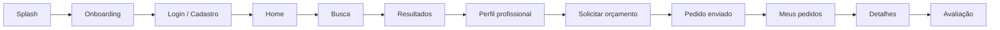
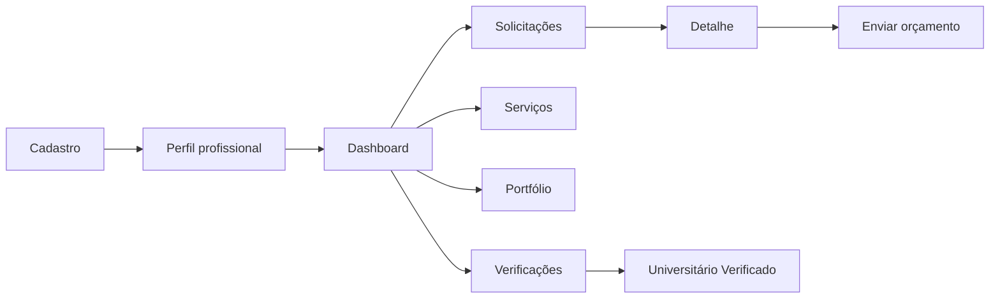

# Resolve Aí

<p align="center">
  
</p>

<p align="center">
  <strong>Quem precisa encontra. Quem sabe fazer, resolve.</strong>
</p>

## Sobre o projeto

O **Resolve Aí** é um protótipo de plataforma digital para conectar clientes a prestadores de serviços autônomos de forma simples, organizada e confiável.

A proposta transforma a indicação informal de profissionais em uma experiência digital com **perfis profissionais, portfólio, avaliações, reputação, verificações, busca e solicitação de orçamento**.

O foco inicial está em serviços do cotidiano, como limpeza, elétrica, manutenção, ar-condicionado, informática, design, fotografia e aulas particulares.

## Objetivo do protótipo

Demonstrar, de forma navegável, como o sistema funcionaria na prática e como o usuário interage com a solução.

O protótipo foi desenvolvido com abordagem **mobile-first**, com referência de tela de aproximadamente **390 × 844 px**.

Nesta etapa, os dados são simulados. O objetivo é validar **fluxo, organização, usabilidade e proposta de valor**, sem implementar ainda toda a infraestrutura de backend de um marketplace.

## Identidade visual

- **Azul-marinho:** `#063653`
- **Laranja:** `#FF6B0B`
- Estilo: moderno, simples e minimalista
- Interface pensada prioritariamente para uso em dispositivos móveis

## Fluxos disponíveis

### Cliente



### Prestador



Documentação completa do fluxo: [docs/fluxo.md](RESOLVE-AI/docs/fluxo.md)

Casos de uso: [docs/casos-de-uso.md](RESOLVE-AI/docs/casos-de-uso.md)

## Principais funcionalidades demonstradas

### Cliente

- Cadastro e escolha do tipo de uso
- Home com categorias de serviços
- Busca e filtros
- Lista de profissionais
- Perfil profissional
- Avaliações e indicadores de reputação
- Solicitação de orçamento
- Acompanhamento de pedidos
- Avaliação após o serviço

### Prestador

- Configuração do perfil profissional
- Dashboard
- Recebimento de solicitações
- Envio de orçamento
- Cadastro de serviços
- Portfólio
- Verificações
- Fluxo de **Universitário Verificado**

### Administração

- Visão geral de usuários e prestadores
- Categorias
- Verificações pendentes
- Denúncias

## Diferenciais

- Centralização de profissionais e serviços locais
- Perfis com reputação, avaliações e portfólio
- Verificação de informações
- Selo **Universitário Verificado** para prestadores com vínculo acadêmico
- Fluxo simples de busca, contratação e acompanhamento
- Interface mobile-first com navegação consistente

## Usabilidade e acessibilidade

O protótipo utiliza:

- Hierarquia visual clara
- Contraste entre elementos principais
- Campos com rótulos visíveis
- Botões e áreas de toque adequados para dispositivos móveis
- Navegação consistente entre as áreas
- Controles HTML nativos sempre que possível
- Texto alternativo na identidade visual

A implementação atual representa uma etapa de prototipação e não declara conformidade integral com uma norma específica de acessibilidade.

## Compatibilidade com a atividade acadêmica

O projeto foi organizado para atender aos itens solicitados na atividade de prototipação:

| Item solicitado | Onde está representado |
| --- | --- |
| Nome do projeto | Resolve Aí |
| Identidade visual inicial | Paleta azul-marinho e laranja + estilo mobile |
| Fluxo do sistema | `RESOLVE-AI/docs/fluxo.md` |
| Ordem das telas e lógica de uso | Protótipo navegável + documento de fluxo |
| Diagrama de caso de uso | `RESOLVE-AI/docs/casos-de-uso.md` |
| Protótipo digital | Implementação em Laravel/Blade/CSS/JavaScript |
| Telas organizadas | Fluxos de cliente, prestador e administração |
| Uso consistente das cores | Identidade aplicada em toda a interface |
| Navegação clara | Botões, cabeçalhos e navegação inferior |
| Funcionalidades | Busca, perfil, orçamento, pedidos, avaliações e gestão do prestador |
| Diferencial | Verificações, reputação e Universitário Verificado |
| Fácil utilização | Fluxos lineares e interface mobile-first |

## Tecnologias

- PHP 8.3+
- Laravel 13
- Blade
- JavaScript
- Tailwind CSS 4
- Vite 8

## Executando o protótipo

Entre na pasta da aplicação:

```bash
cd RESOLVE-AI
```

Instale as dependências:

```bash
composer install
npm install
```

Crie o arquivo de ambiente e a chave da aplicação:

### Windows (CMD)

```bat
copy .env.example .env
php artisan key:generate
```

### Linux/macOS

```bash
cp .env.example .env
php artisan key:generate
```

Compile os arquivos do front-end e inicie o servidor:

```bash
npm run build
php artisan serve
```

Depois acesse:

`http://127.0.0.1:8000`

> O protótipo atual utiliza dados simulados e não depende de banco de dados para navegação das telas.

## Escopo desta entrega

A versão atual demonstra a experiência do produto e seus fluxos principais.

Ainda não fazem parte desta etapa:

- Persistência real dos dados
- Pagamentos
- Chat em tempo real
- Validação real de documentos
- Integrações externas

Esses recursos podem ser implementados em etapas posteriores do desenvolvimento.

## Estrutura principal

```text
UniFellas/
├── README.md
└── RESOLVE-AI/
    ├── resources/
    │   ├── views/app.blade.php
    │   ├── css/app.css
    │   └── js/app.js
    ├── public/images/
    ├── docs/
    │   ├── fluxo.md
    │   └── casos-de-uso.md
    └── routes/web.php
```

## Projeto acadêmico

Protótipo desenvolvido para atividade acadêmica de **Metodologias de Design para Inovação em Sistemas de Informação**.
