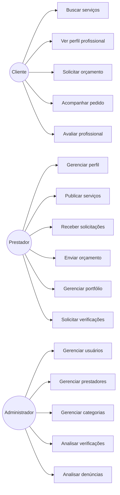

# Resolve Aí — Casos de Uso

## Atores

- **Cliente:** pesquisa profissionais, consulta reputação, solicita orçamento, acompanha pedidos e avalia serviços.
- **Prestador:** mantém perfil e portfólio, publica serviços, recebe solicitações, envia orçamentos e solicita verificações.
- **Administrador:** acompanha usuários, prestadores, categorias, verificações pendentes e denúncias.

## Escopo do protótipo

As ações principais são navegáveis, porém usam dados simulados. Backend de marketplace, pagamentos, chat e validações externas ficam fora desta primeira entrega.
