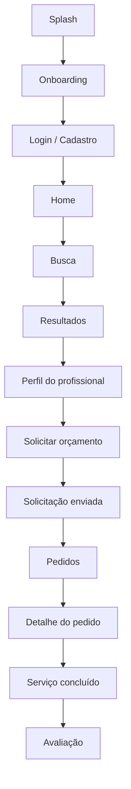
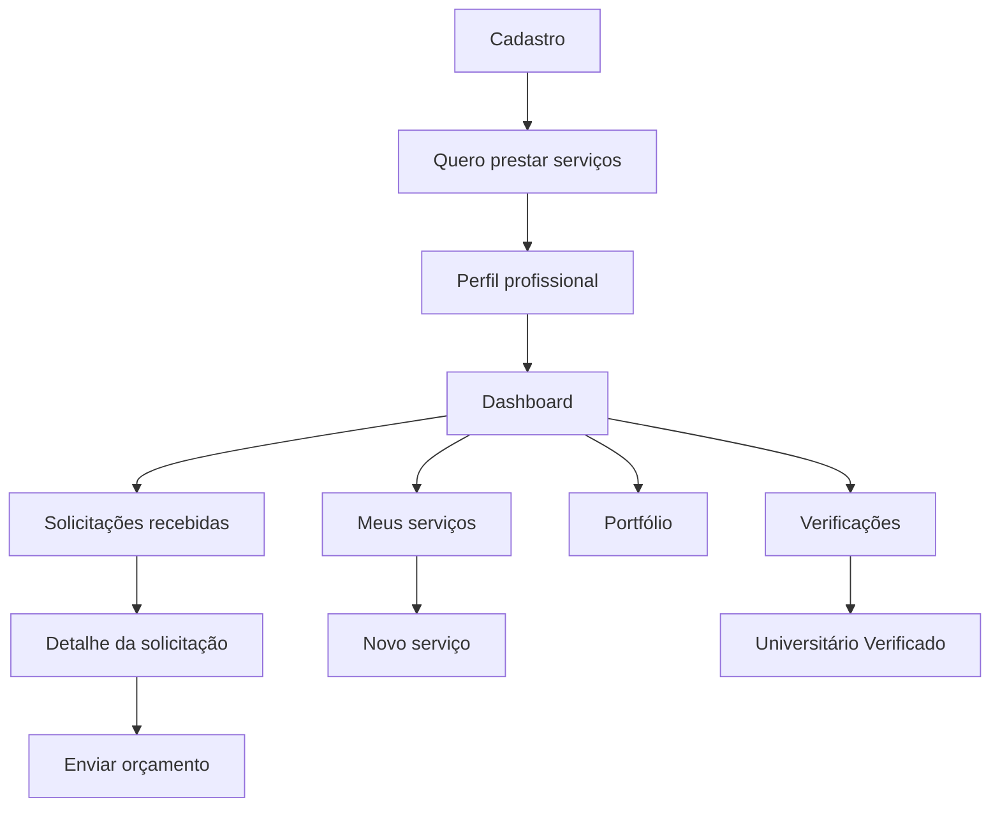

# Resolve Aí — Fluxo do Protótipo

Protótipo mobile-first concebido para 390 × 844 px.

## Cliente

## Prestador

## Navegação

Os fluxos são simulados com dados mockados. Não há pagamentos, validação documental real ou persistência nesta etapa. O objetivo é demonstrar experiência, lógica e caminho do usuário.
